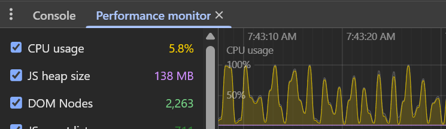
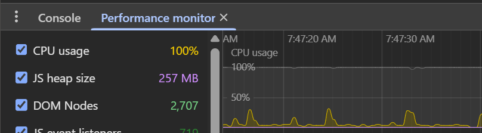

# Performance Improvements

### Metrics Report (Batch of 100 Events)

#### ⏱️ Load Times

| Version | Time | Comparison                | % Improvement |
| :--- | :--- | :--- | :--- |
| Original | 1:35 | 🟥​🟥​🟥​🟥​🟥​🟥​🟥​🟥​🟥​🟥​🟥​🟥​🟥​🟥​🟥​🟥​🟥​🟥​🟥 | |
| New | 0:24 | 🟩​🟩​🟩​🟩​🟩 | **~75% Faster** |

#### ⚡ Actions Called

| Version | Actions | Comparison                 | % Improvement |
| :--- | :--- | :--- | :--- |
| Original | 3,492 | 🟥​🟥​🟥​🟥​🟥​🟥​🟥​🟥​🟥​🟥​🟥​🟥​🟥​🟥​🟥​🟥​🟥 | |
| New | 1,074 | 🟩​🟩​🟩​🟩​🟩 | **~69% Fewer** |

#### 🌐 API Requests

| Version | Requests | Comparison              | % Improvement |
| :--- | :--- | :--- | :--- |
| Original | 167 | 🟥​🟥​🟥​🟥​🟥​🟥​🟥​🟥​🟥​🟥​🟥​🟥​🟥​🟥​🟥​🟥​🟥 | |
| New | 8 | 🟩 | **~95% Fewer** |

1.  🏁 **Significantly Reduced Race Conditions**: Multiple race conditions affecting status messages in the UI have been substantially mitigated. Adjustments include a removal of the Event Summary call and improved handling of messaging streams for `Event Changed` and `Event Status Changed`, which minimizes competition and potential conflicts between them.

2.  🚫 **Eliminated Duplicate Updates**: Introduced logic to manage duplicate changes for the same Event or Rec. Now, if both Processing Surfaces and Complete messages are grouped together in the same debounce grouping, only the most recent update is processed, preventing an outdated status from being applied to the state.

3.  🔄 **Improved User Interaction Flow**: The Event Info panel and Rec Info panel now close much faster upon saving. This allows us to depend on the IOT messaging, and more concisely shows individual status updates.

4.  ⚡ **CPU Performance**: Previously, for `Rec Changed` and `Event Changed` IOT messaging, we often plateaued at 100% as messages were being received. Spikes are overall much lower now, which allows the UI to process more consistently.

	#### Rec Changed Messaging (Original)
	
	
	#### Rec Changed Messaging (New)
	

